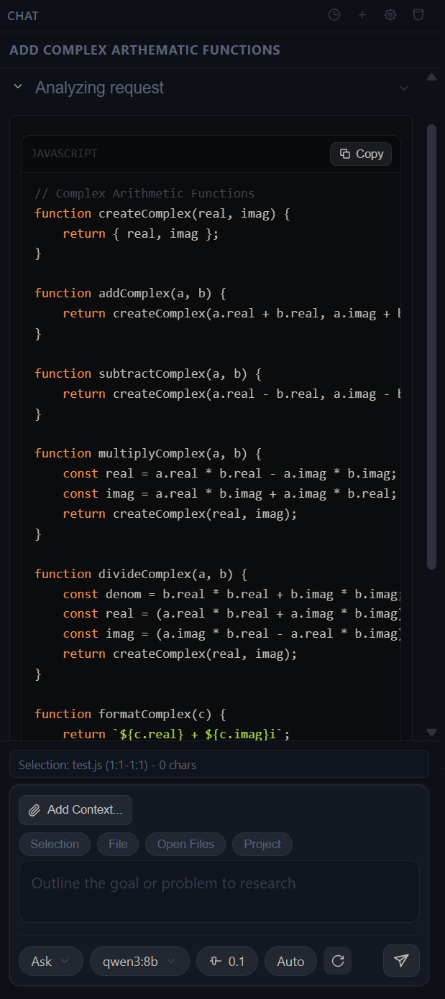

# Olla Chat

**Professional AI coding assistant for VS Code, built Ollama-first.**

Olla Chat gives you Ask, Plan, and Agent workflows in one sidebar, with streaming responses, context-aware editing, human approvals, and local-model control.



## Why Olla Chat

- Ollama-first local or remote model routing
- Multi-session conversations with mode + model per chat
- Selection-aware editing for real code writing workflows
- Human-in-the-loop safety for file-changing actions
- Clean, theme-aware interface designed for daily dev use

## Core Features

- **Modes:** `Ask`, `Plan`, `Agent`
- **Streaming UI:** token streaming + timeline events
- **Context controls:** `Selection`, `File`, `Open Files`, `Project`
- **Smart edits:** selection replace flow with apply/undo
- **Attachments:** file + image upload support
- **Vision model checks:** warns when selected model is not vision-capable
- **Model controls:** picker + temperature at composer level
- **Debug observability:** detailed internal logs via Output channel

## Quick Start

1. Install the extension.
2. Start Ollama (or point to your remote Ollama endpoint).
3. Open **Olla Chat** from the Activity Bar.
4. Choose a model and mode, then send a prompt.

Default endpoint:

```text
http://localhost:11434
```

## How To Use

### 1. Choose a mode

- **Ask:** direct Q&A, explanations, focused answers
- **Plan:** structured step-by-step planning before action
- **Agent:** autonomous execution with approval gates for risky operations

### 2. Control context

Use scope chips to decide what the model sees:

- `Selection` for selected text/code
- `File` for active editor file
- `Open Files` for broader current-work context
- `Project` for repository-level understanding

### 3. Edit from chat

- In **Agent mode**, selection-targeted edit responses can auto-apply.
- In **Ask mode**, you get an explicit apply confirmation.
- Use **Undo** from chat to revert applied selection replacements.

### 4. Work with attachments

- Attach files/images from the composer.
- For image analysis, select a vision-capable model.

## Configuration

Settings prefix: `olla-chat.*`

- `ollamaUrl` - Ollama base URL
- `ollamaModel` - default model
- `temperature` - generation temperature (`0` to `2`)
- `defaultMode` - `ask | plan | agent`
- `approvalPolicy` - `human_gated | auto_safe`
- `contextPolicy` - `auto_light | manual_only | always_project`
- `maxContextFiles` - max files sampled for project context
- `debugLogs` - verbose logs in **Olla Chat Debug**

## Troubleshooting

- **Model not found:** run `ollama list`, then `ollama pull <model>`.
- **Image error on vision request:** choose a model marked vision-capable.
- **No response stream:** verify `ollamaUrl`, model availability, and logs (`Olla Chat Debug`).